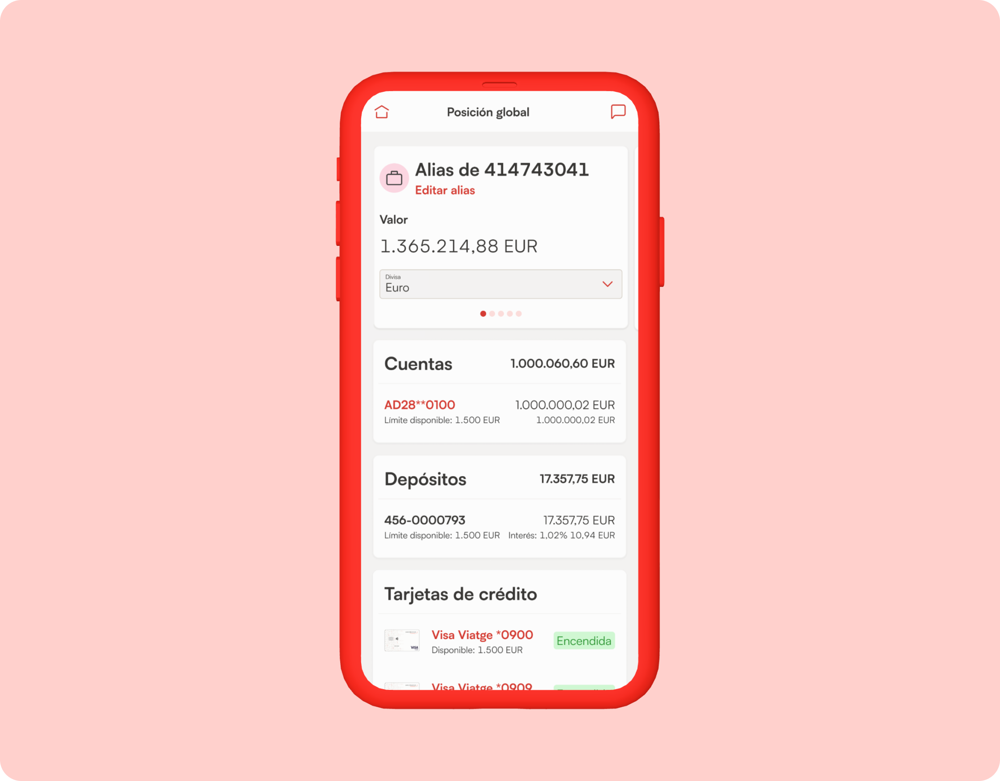
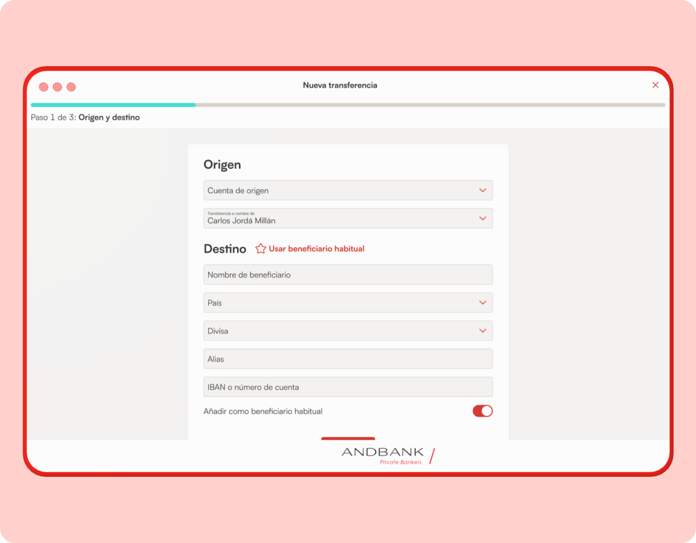
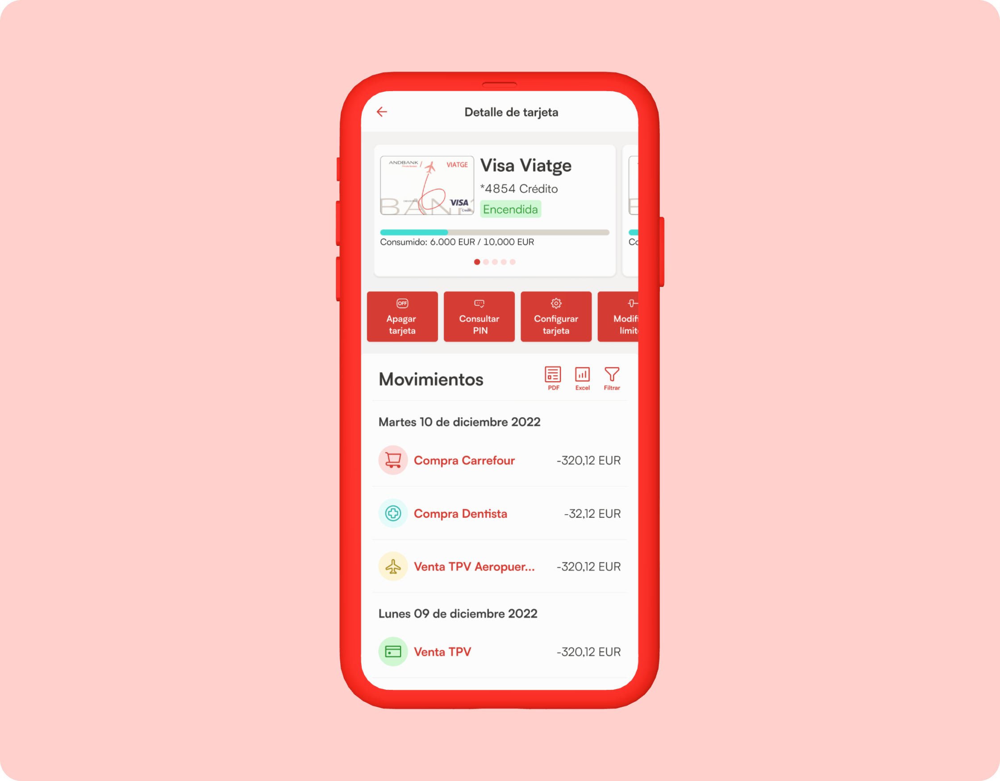

## Objetivos
1. Rediseño completo de la plataforma Andbank y la App Andbank Wealth para mejorar su diseño, accesibilidad y experiencia de usuario
2. Creación de un sistema de diseño que de soporte no solo a las plataformas de clientes si no también a plataformas internas.

## Desafio
Rediseño de la plataforma bancaria de Andbank Andorra mejorando la experiencia de usuario. Este rediseño va acompañado de la creación de un sistema de diseño que aumente la velocidad y consistencia de futuros desarrollos.

## Desarrollo del proyecto

El primer paso fue realizar una auditoría de la plataforma que en ese momento estaba en producción. El objetivo de esta auditoría era analizar incoherencias en la plataforma actual y realizar un inventario de elementos de la interfaz y colores y tipografía utilizados.

Posteriormente creamos la libería de elementos fundacionales del proyecto: Uso del color, tipografía y pesos tipográficos, librería de iconos…

Una vez aprobados los elementos fundacionales empezamos a diseñar la interfaz de usuario construyendo en paralelo los componentes reutilizables para completar el sistema de diseño. Debido a las necesidades del proyecto optamos por una librería única de componentes responsive usados tanto para escritorio como la versión móvil.

El despliegue de esta nueva interfaz fue faseado conviviendo páginas con el diseño actual y con el nuevo diseño por lo tanto, la nueva interfaz se diseñó para que esta convivencia fuese lo más coherente posible.

Una vez finalizada esta fase de transición se continúo con la evolución de la plataforma incluyendo nuevas funcionalidades y rediseñando los procesos en orden: del más usado al menos usado.

El resultado es una plataforma que aplica los mejores estándares de la industria y supone una mejora notable tanto en la experiencia de usuario como en su aportación al negocio.

## Aprendizajes del proyecto

- - Empezar el proyecto con una auditoría para conocer que tienes, que falta y que falla en la experiencia de partida.
- Elegir los elementos core del proyecto (color, tipografía, escalas, iconos…) teniendo en cuenta la marca, el público objetivo y las necesidades del proyecto.
- Ceñir el diseño de los componentes a estos fundacionales para asegurar la coherencia y la accesibilidad.
- Diseñar primero y posteriormente componentizar. Cuando tienes una nueva necesidad diseñar sin limitarte a los componentes que existen en ese momento y a posteriori crear un componente que cubra esa necesidad en el futuro asegurándonos de que sea escalable a la mayor cantidad de casos de uso posibles.