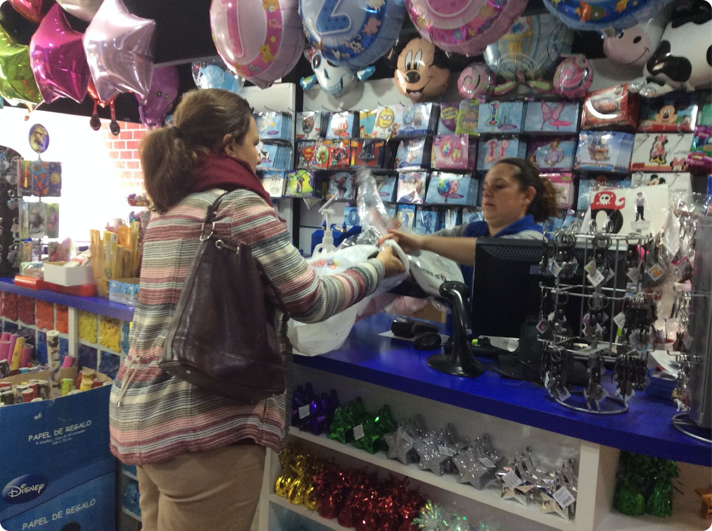
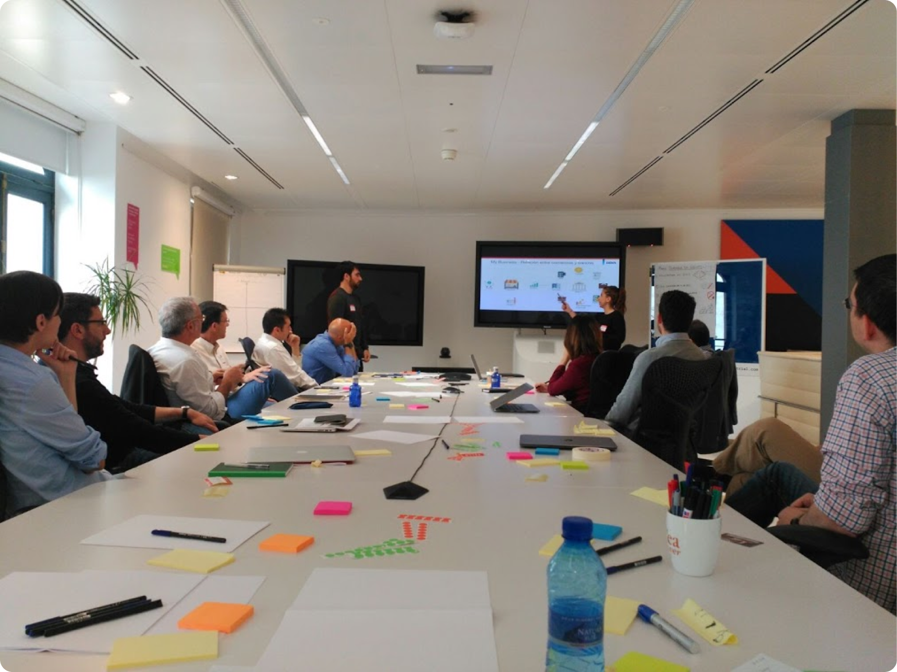
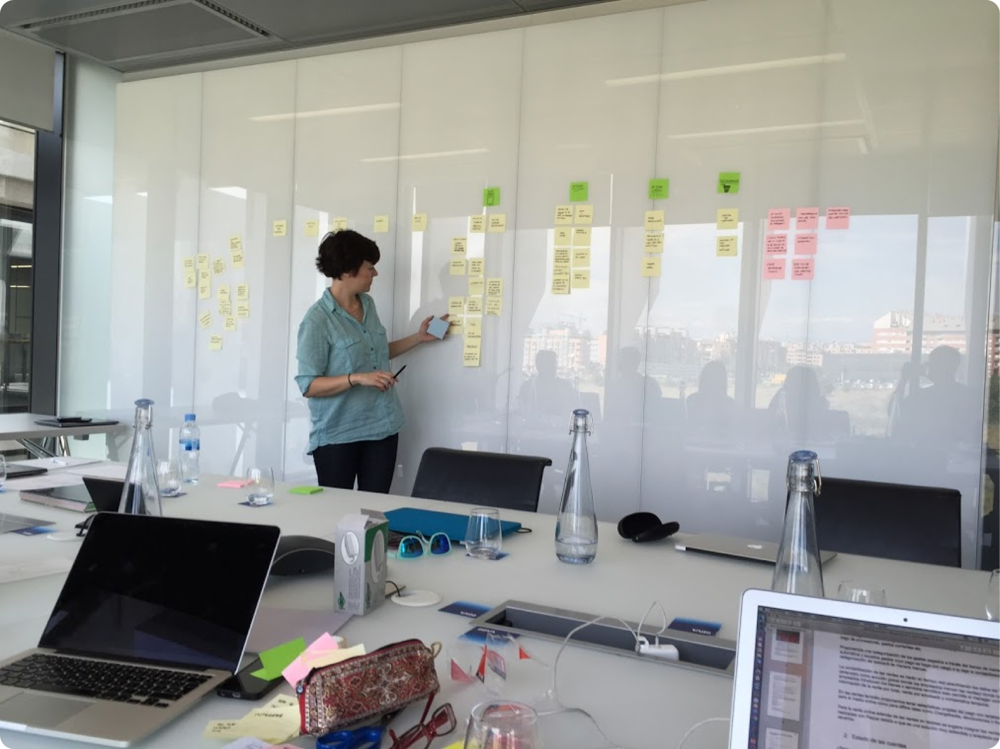
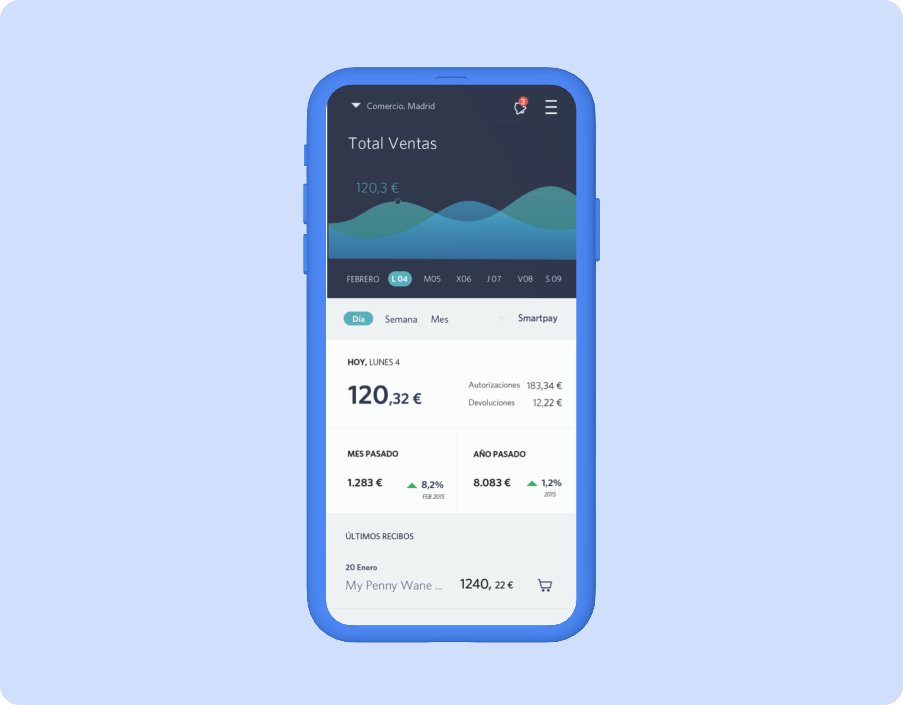

## Objetivos
1. Descubrir los principales desafíos a los que se enfrenta una pyme en su día a día.
2. Ver en qué áreas puede aportar valor el banco a las empresas.
3. Crear un nuevo producto que ayude a las pymes en su actividad diaria.

## Desafío
El departamento de Adquirencia del banco (TPV) se planteó el desafío de ofrecer un nuevo servicio diseñado para que los comercios simplifiquen la administración de sus negocios mediante una gestión eficiente, la mejora las ventas y la comunicación con el banco.

## Desarrollo del proyecto

Una vez establecidos los objetivos de este proyecto, definimos junto con BBVA el público objetivo para lanzar una investigación cualitativa.

En esta investigación cualitativa, hicimos un trabajo de inmersión en doce comercios para ver cómo trabajaban en su día a día, sobre todo, en lo relacionado con los pagos y la gestión de las finanzas. Además, hicimos entrevistas en profundidad y les enseñamos un prototipo de posibles funcionalidades del servicio.

Una vez extraídos los resultados de la investigación, se lo presentamos a los *stakeholders* del proyecto y trabajamos en varias sesiones de ideación.

En la primera, mediante un proceso de convergencia-divergencia, extrajimos todas las posibles funcionalidades que podían aportar valor a este tipo de usuarios a partir de los resultados de la investigación.

En una segunda sesión, mediante una matriz esfuerzo-valor, jerarquizamos las funcionalidades para la construcción de un primer MVP y la posterior hoja de ruta de evolución hacia un servicio completo.

En una tercera sesión, cocreamos junto con los *stakeholders* el primer MVP. Con el resultado de esta tercera sesión, prototipamos un primer MVP estratégico y trasladamos el conocimiento al equipo interno de BBVA para su construcción y evolución.

Actualmente, My Business es una de las principales propuestas de valor de BBVA para pymes y sigue la hoja de ruta marcada.

## Aprendizajes del proyecto

- Encontrar el equilibrio entre lo que los usuarios necesitan, lo que es viable tecnológicamente y lo que aporta valor al negocio puede estar al límite de lo imposible.
- Diseñar un nuevo producto para usuarios muy heterogéneos te obliga a buscar los puntos comunes en los que puedas aportar valor a todos.
