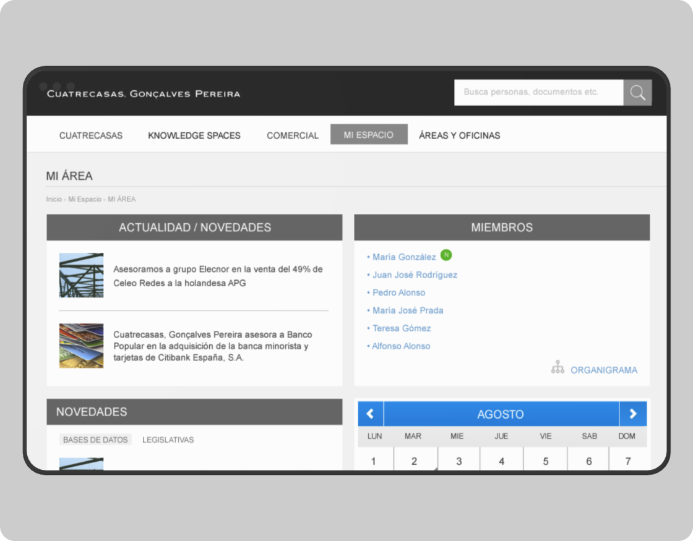
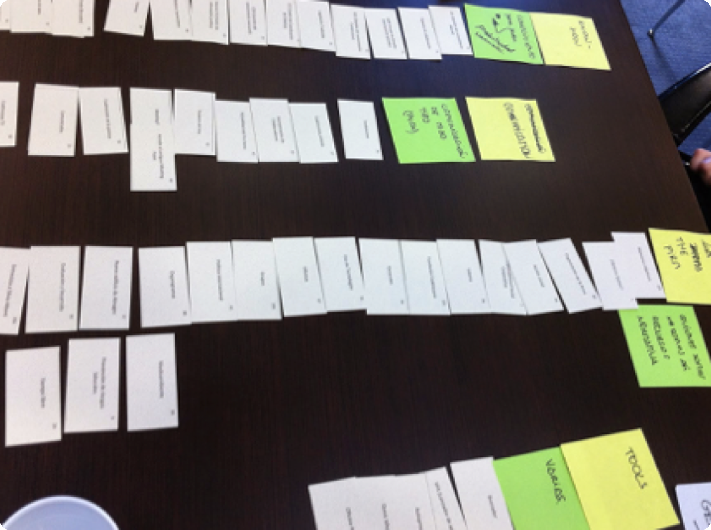
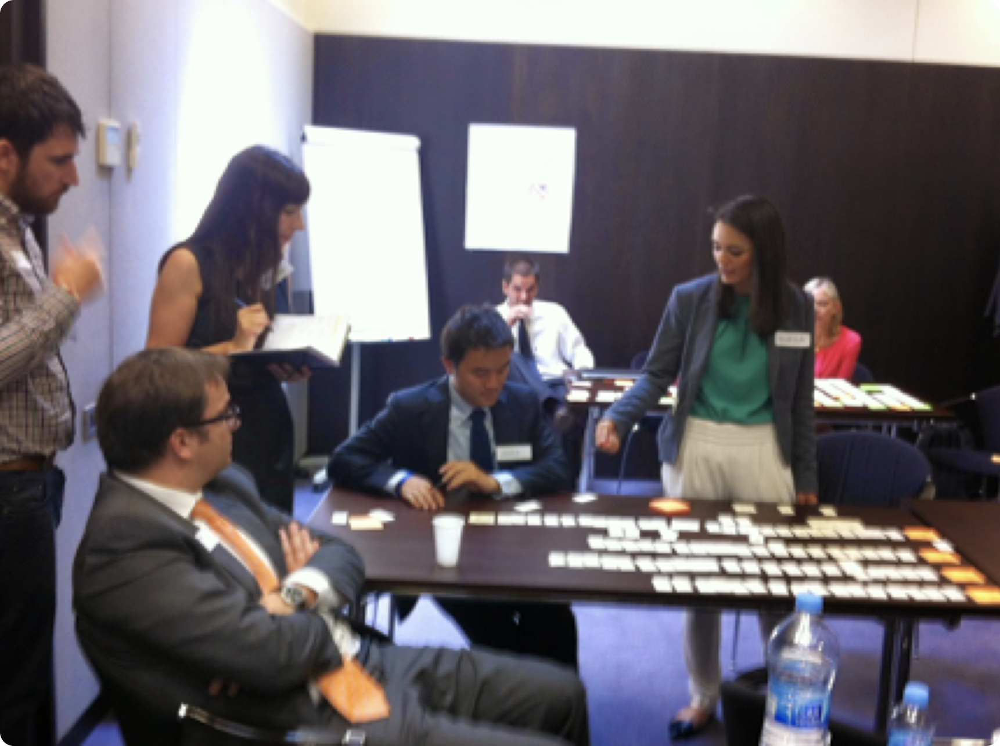
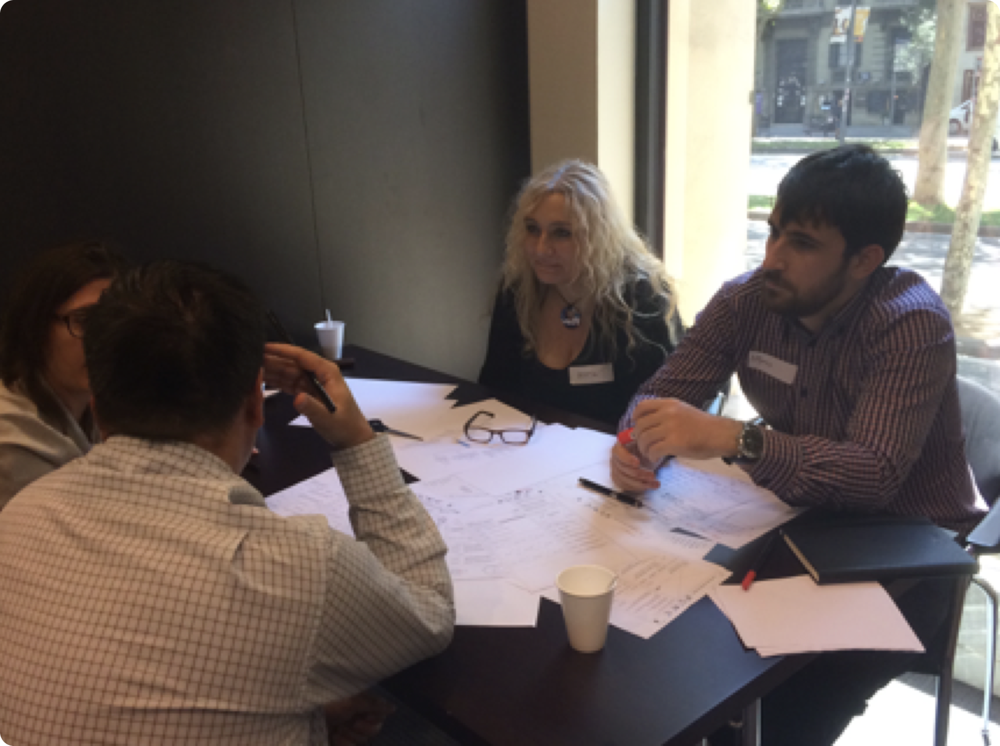
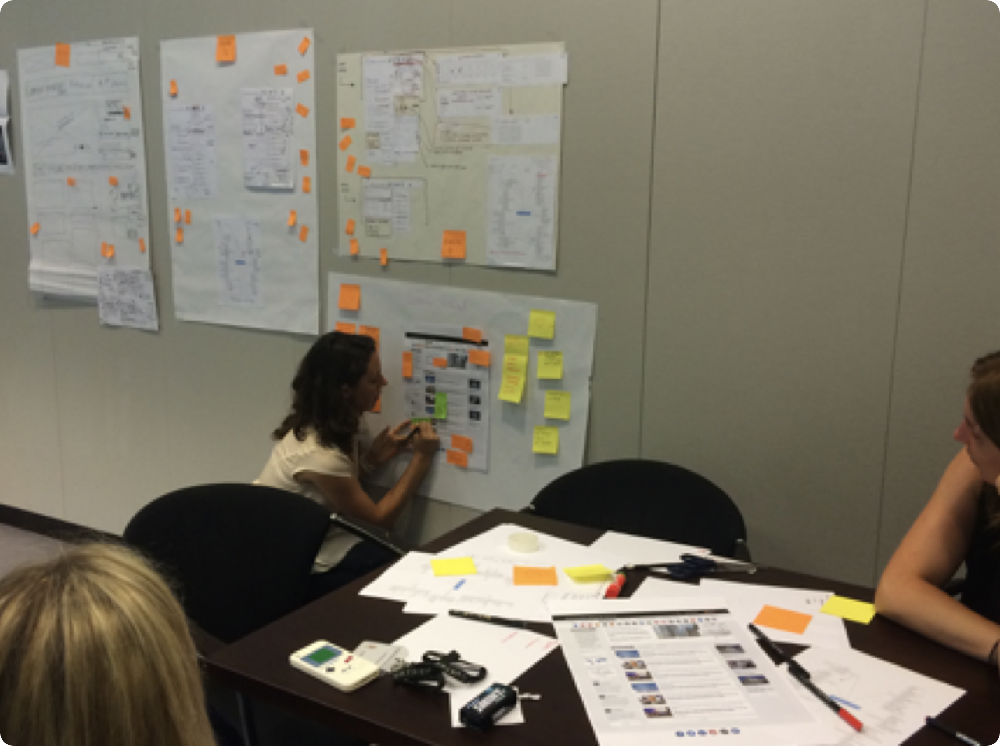
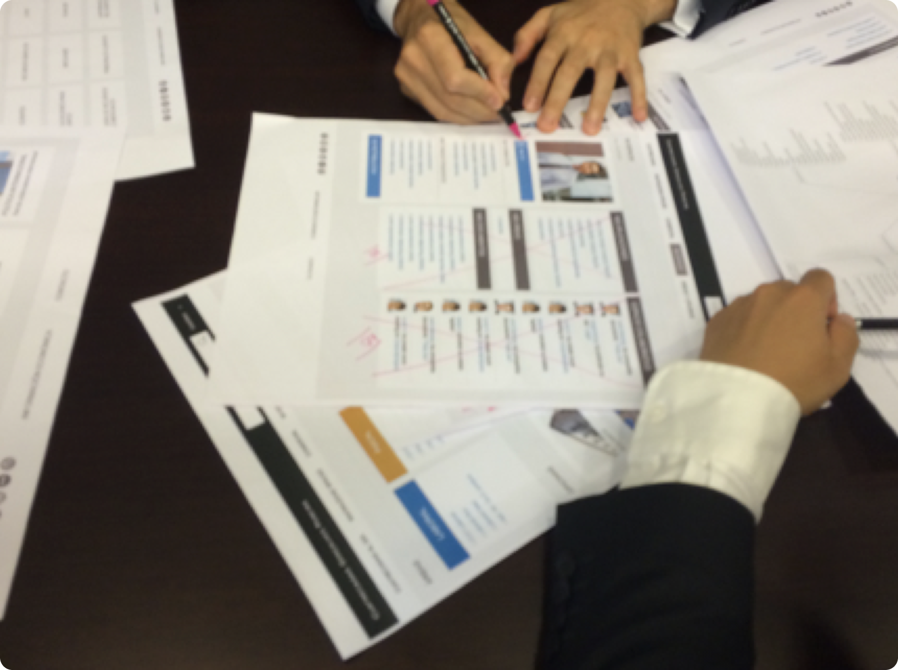

## Objetivos
1. Aumentar el uso de las herramientas internas facilitando que los usuarios encuentren las herramientas cuando las necesitan.
2. Reducir la curva de aprendizaje para nuevas incorporaciones.
3. Aumentar la relación de colaboración entre los diferentes empleados.

## Desafio
Rediseñar la intranet de Cuatrecasas para poner a disposición de los empleados todas las herramientas internas existentes y aquellas a las que no se les estaba sacando provecho.

## Desarrollo del proyecto

Dentro del proyecto de desarrollo de la nueva intranet, se realizaron sesiones de trabajo utilizando la metodología de *Design Thinking* para la definición de las pantallas claves de la intranet.

En el proceso de definición y diseño participaron distintos tipos de usuarios de diferentes áreas para asegurarnos de contar con todos los puntos de vista posibles para adaptar la intranet a las necesidades de los usuarios (empleados).

Este proceso estuvo estructurado en tres sesiones de cocreación.

En la primera sesión, trabajamos juntos en el árbol de contenido, la *home* y la *subhome* de área de la nueva intranet de Cuatrecasas. Para ello, los usuarios decidieron qué contenido hacía que su trabajo diario fuera más ágil y qué contenidos eran imprescindibles. Con este contenido, trabajamos un *Card Sorting* para definir la nueva arquitectura de información. También mediante prototipado colaborativo se trabajó en la *home*, el menú y la sección de noticias.

La segunda sesión comenzó con una recapitulación de la sesión anterior y la presentación de un árbol de contenido sobre el que se hizo una nueva iteración buscando la simplificación. Posteriormente, se presentaron los prototipos de algunas pantallas identificadas como relevantes y, por grupos, se deconstruyeron y volvieron a modificarse.

En la tercera sesión se presentó el diseño visual de las pantallas más relevantes y se recogieron las opiniones de los usuarios para una posterior iteración. Los cambios que surgieron en esta sesión se aplicaron en las pantallas finales de la nueva intranet.

## Aprendizajes del proyecto

En este proyecto, trabajamos desde el primer momento con los diferentes perfiles de usuarios que hacen uso de la intranet. Entendimos sus necesidades y creamos y validamos de manera conjunta la arquitectura de información. También extrajimos hallazgos muy valiosos para el diseño final de la intranet.
