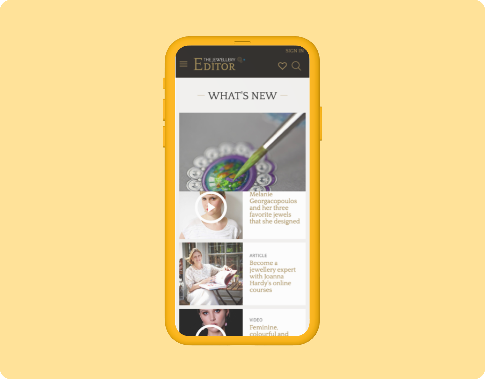
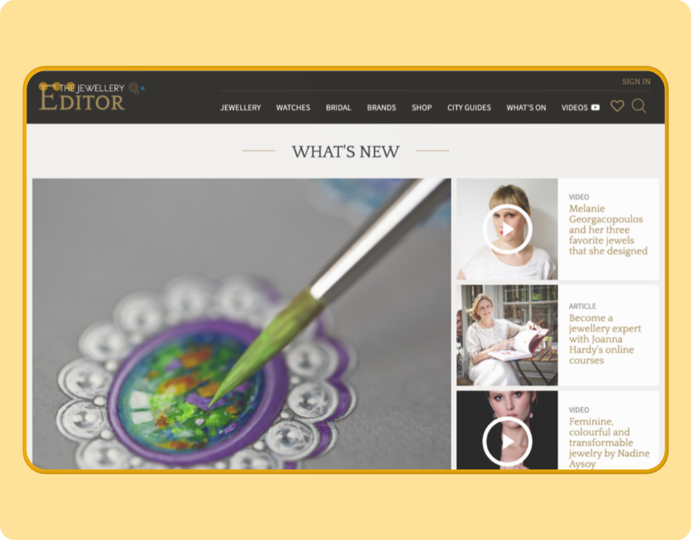

## Objetivos
1. Tener un diseño visual y de interacción a la altura del mercado.
2. Maximizar los ingresos por publicidad.
3. Centrar la atención en el contenido, dando relevancia a la calidad de las imágenes y de los vídeos.
4. Reducir la curva de aprendizaje del CMS.

## Desafio
The Jewellery Editor necesitaba un rediseño para estar a la altura del mercado al que se dirigía. Además, presentaba grandes carencias de usabilidad tanto para los visitantes como para los editores y redactores.

## Desarrollo del proyecto

Durante este proyecto, rediseñamos tanto el *front* como el *back* de la web The Jewellery Editor. 

Para ello, desarrollamos una investigación con usuarios y nos centramos en visitantes de la web. Entrevistamos en profundidad a seis usuarios intensivos de la web para extraer los principales hallazgos en los que apoyarnos a la hora de rediseñar el *front*.

Una vez finalizada la investigación, trabajamos conjuntamente con el equipo de The Jewellery Editor en varias sesiones de cocreación. En la primera, definimos la arquitectura de información y la línea de diseño. En sesiones posteriores, mostramos los primeros prototipos e iteramos sobre estos siempre teniendo en cuenta la opinión de los diferentes actores involucrados en el proyecto.

En paralelo, trabajamos con el equipo de editores a través de un trabajo de inversión con el objetivo de conocer en profundidad de su forma de desarrollar las diferentes piezas de contenido y diseñar el nuevo *back-office* centrados en hacer posible una mayor agilidad a la hora de la introducir el contenido.

También definimos la estrategia comercial de la web trabajando en los diferentes formatos publicitarios que podían ofrecer a anunciantes. No solo en publicidad *display* si no también en contenido patrocinado.
## Aprendizajes del proyecto

- - El equilibrio entre ofrecer una experiencia de calidad y la capacidad de la web de generar ingresos: parte de nuestra tarea como diseñadores de interacción fue crear los formatos publicitarios y editoriales que les permitiesen ser rentables.
- Pensar no solo en la experiencia de los usuarios que consumen el contenido, sino también en la de los creadores. Crean más de veinte nuevos contenidos a la semana, en diferentes países, y, en dicha creación, participan una gran variedad de contribuidores.
- Trabajar con tal cantidad de contenido editorial exige una arquitectura de información flexible y muy bien estudiada para que al usuario le resulte más fácil encontrar la aguja en el pajar.

## ¿Qué es JED?
Una revista de lujo online y una plataforma de redes sociales fundada en 2010 que se centra por completo en joyas y relojes de lujo, y que tiene un impacto mundial de 2,8 millones de usuarios al mes. 