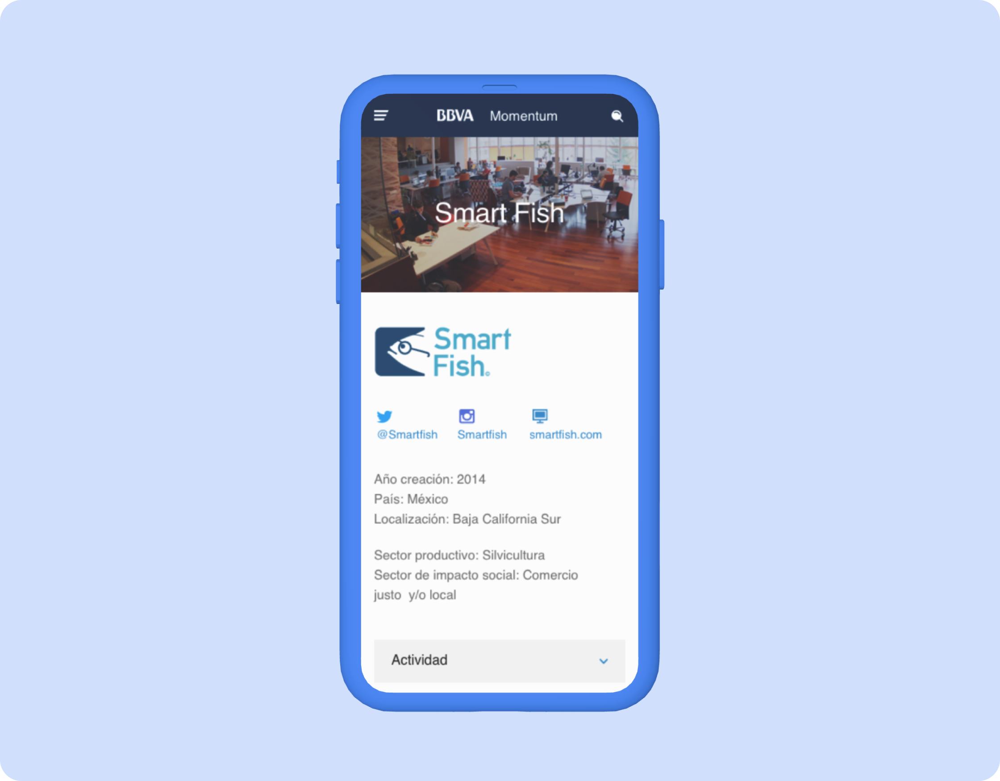
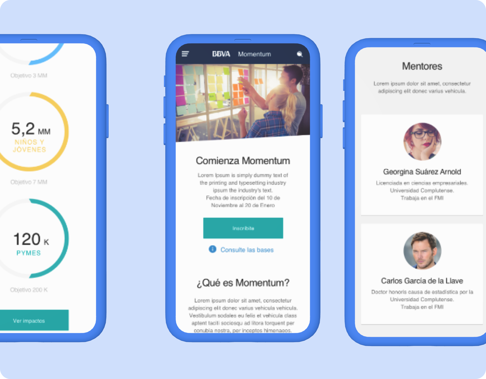
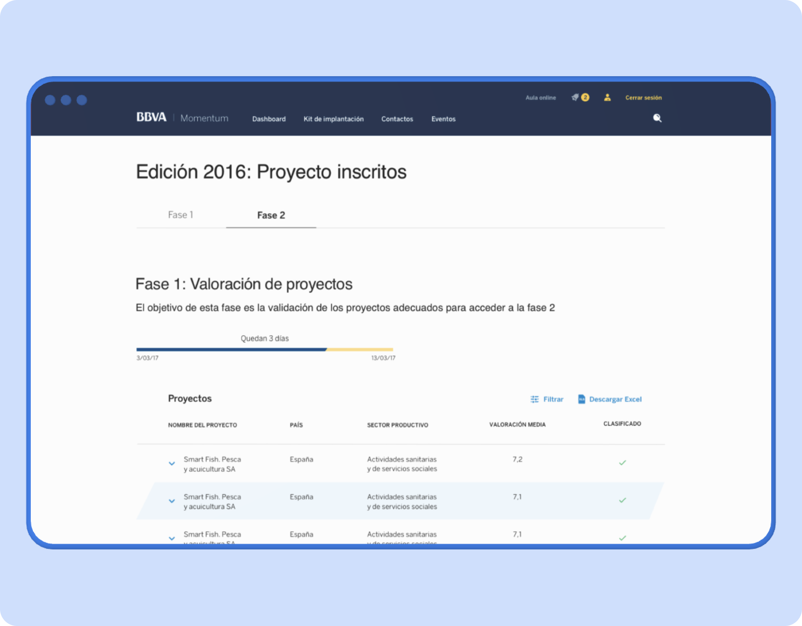

## Objetivos
1. Aumentar el número y la calidad de los participantes del programa.

2. Aumentar y consolidar el impacto de las *start-ups* participantes.

3. Crear un ecosistema de apoyo al emprendedor social.

## Desafío
Rediseñar la plataforma del programa Momentum Project para aumentar el peso del emprendimiento social en la sociedad.

## Desarrollo del proyecto

Durante este proyecto, diseñamos y construimos la nueva web de BBVA Momentum Project empleando la metodología *agile* en *sprints* de dos semanas. 

El proyecto lo dividimos en dos fases:

- En la primera, se abordó la parte pública de la web, donde se comunicaban las características y el funcionamiento del programa y se llevaba a cabo el registro de proyectos. En los formularios de registro, se puso el foco en la usabilidad y en la accesibilidad del mismo. También desarrollamos toda la estrategia de comunicación entre Momentum y los proyectos registrados durante toda la vida del programa.
- En la segunda, se diseñó y maquetó toda la parte privada del programa. Esta sección tenía dos vertientes: la parte privada para emprendedores, a través de la cual recibirían el *mentoring* y la formación los proyectos seleccionados, y la parte privada para mentores y jueces, donde, en primer lugar, emitirían sus valoraciones sobre los proyectos registrados, seleccionarían los proyectos clasificados y desarrollarían todo el *mentoring* con dichos proyectos.

El resultado ha sido una plataforma que, en su primer año de puesta en funcionamiento, hizo que aumentaran un 63 % los proyectos apuntados y recibió muy buenas valoraciones por parte de los mentores, por la agilidad con la que les permitía trabajar. El resultado de este proyecto sigue *online* y ha sido la plataforma en la que se han basado las tres últimas convocatorias.
## Aprendizajes del proyecto

- Diseñar una plataforma bilateral: por un lado, una parte pública que diese a conocer el programa y que permitiese el registro de las iniciativas, y, por otro, una parte privada para la relación entre los proyectos y sus mentores.
- Diseñar, pero, sobre todo, velar por que la web en producción cumpla con los más altos estándares de accesibilidad.