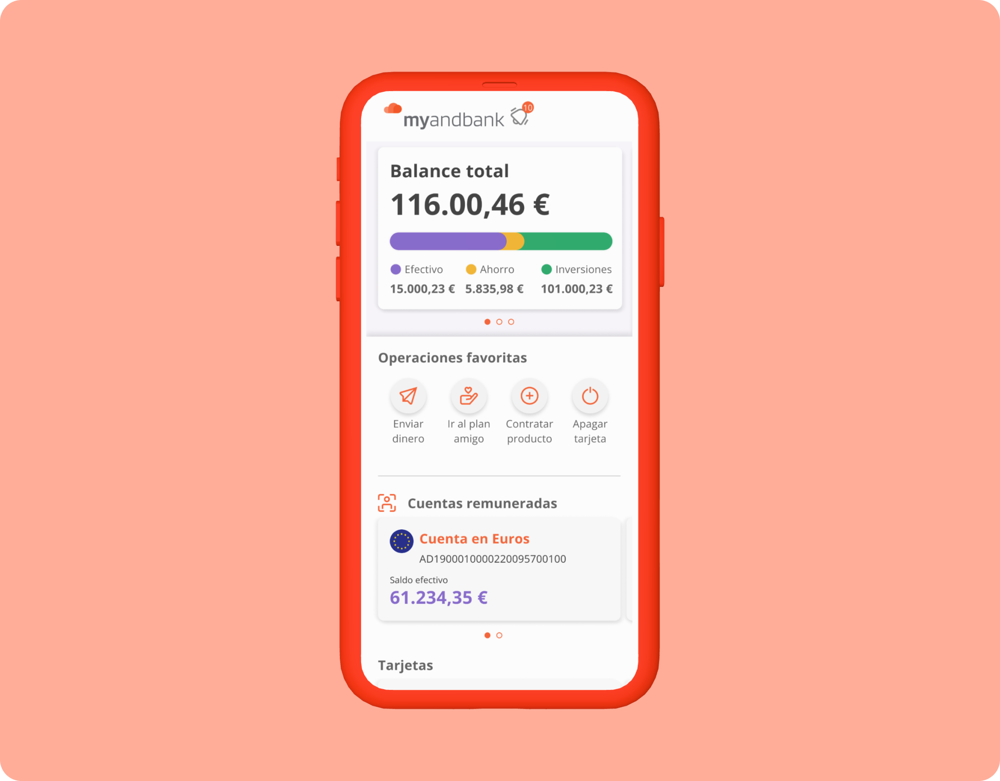
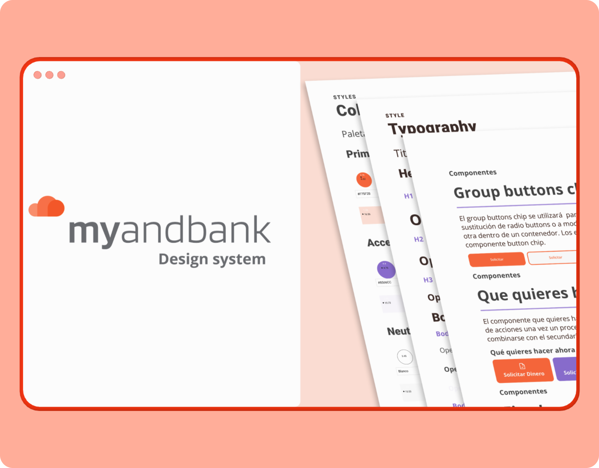
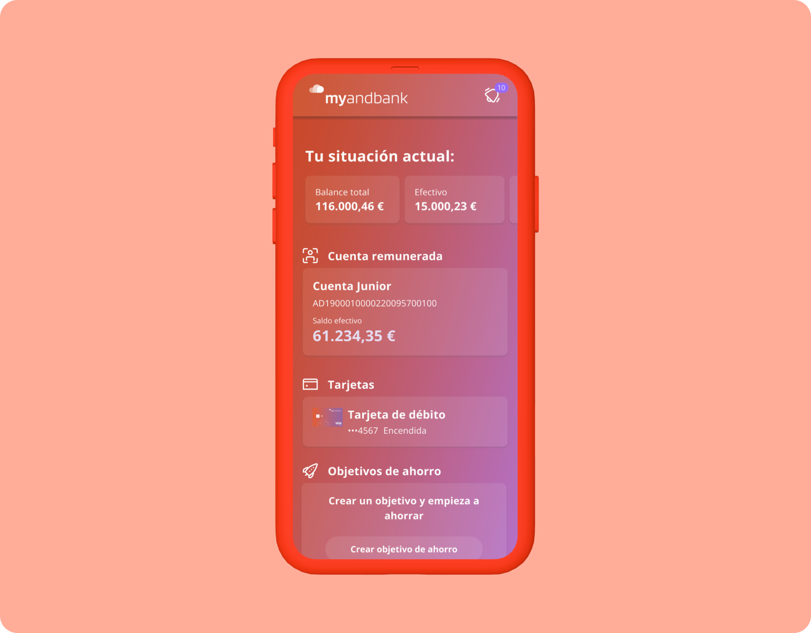

## Objetivos
1. Incrementar la cartera de clientes Andbank al dirigirnos a un público objetivo complementario del banco principal
2. Crear un neobanco completo donde el usuario, además de gestionar su día a día, pueda invertir en diferentes activos
3. Crear un banco dirigido a jóvenes, diferenciado del previsto para perfiles adultos con productos y un *look and feel* específicos

## Desafio
Crear un neobanco que funcione como banco del día a día con un público objetivo que se aleja del tradicional del banco matriz, Andbank, más centrado en banca privada.

El banco se debía lanzar en un año desde el inicio del proyecto y con las siguientes características:

1. *Onboarding* 100 % *online,* incluyendo la verificación de identidad
2. Introducción de Bizum en Andorra
3. Incorporación de los productos necesarios para el día a día, además de productos de inversión. En una primera fase, los productos que el cliente podía contratar eran: cuenta en euros, tarjeta de débito y carteras de inversión

Durante esta primera fase, mi rol principal fue ejercer de jefe de diseño, con el equipo de Atmira como diseñadores de interacción y visual. Mis tareas durante esta primera fase consistían en liderar el diseño en el proyecto, velar por la calidad de los entregables y homogeneizar mediante principios de diseño los diferentes entregables.

En una segunda fase del diseño, en la que Atmira deja de participar en el proyecto, mi rol se encarga de hacer los diseños de interacción y visuales de los evolutivos y, en paralelo, de crear el sistema de diseño.

## Desarrollo del proyecto

La primera fase el proyecto consistió en el diseño y creación de un neobanco con cuenta, tarjeta de débito y carteras indexadas. 

Cuando entro al proyecto el diseño, ya está en curso por parte de una consultora externa, por lo que mi rol en esta primera fase es de jefe de diseño; mi labor es establecer la dirección creativa del proyecto y coordinar a los diseñadores externos para garantizar la calidad y la sistematización del diseño.

Una vez finaliza esta primera fase del proyecto, ejerzo de diseñador del mismo, y llevo a cabo las tareas de diseño visual e interacción; asimismo, en paralelo, creo el sistema de diseño del proyecto.

Durante estos años de desarrollo del proyecto, los evolutivos más destacados han sido:

- Lanzamiento de nuevos productos: hemos lanzado múltiples productos dentro de Myandbank, por lo que se ha tenido que dar escala al proyecto para que las nuevas funcionalidades y los nuevos productos no hicieran la experiencia del usuario más compleja
- Lanzamiento de Myandbank Kids y Myandbank Júnior: hemos presentado el banco para jóvenes con un nuevo *look and feel* y funcionalidades específicas, como control parental y *onboarding online* para menores
- Introducción de Bizum en Andorra: MyAndbank fue la primera institución no española en introducir Bizum. Trabajamos mano a mano con Bizum en este hito poniendo especial atención al *onboarding* de una funcionalidad poco conocida por nuestros clientes
- Sistematización del diseño: hemos creado un sistema de diseño, lo que nos ha proporcionado consistencia y velocidad a la hora de diseñar, desarrollar y lanzar al mercado nuevas funcionalidades. Trabajar con *tokens* en el sistema de diseño nos ha permitido hacer un *rebranding* y rediseñar la *app* para menores de manera ágil.

Además del diseño del producto, me he encargado del diseño de piezas de comunicación como la web pública, los correos electrónicos o las pantallas para las *stores*, entre otros.

## Aprendizajes del proyecto

- Creación de una marca desde cero estableciendo el tono y la imagen de marca de acuerdo al público objetivo y el posicionamiento con el que se quería lanzar el nuevo producto.
- Sistematización de diseño creando fundacionales y componentes para lograr diseñar, desarrollar y lanzar funcionalidades con la velocidad requerida para un producto con un crecimiento rápido. La sistematización también nos ha permitido llevar a cabo un *rebranding* de la plataforma principal, como el lanzamiento de la plataforma de menores en un tiempo récord.
- *Onboarding* del cliente a funcionalidades novedosas como Bizum o la compraventa de criptomonedas, donde tiene especial relevancia la comunicación al cliente de las ventajas y riesgos de estas nuevas funcionalidades para asegurarnos de que tengan un nivel de adopción alto
- Creación de un producto escalable no solo creando y manteniendo el sistema de diseño, si no creando una arquitectura de la información que haga que la introducción de nuevas características no redunde en una mayor complejidad para el cliente.