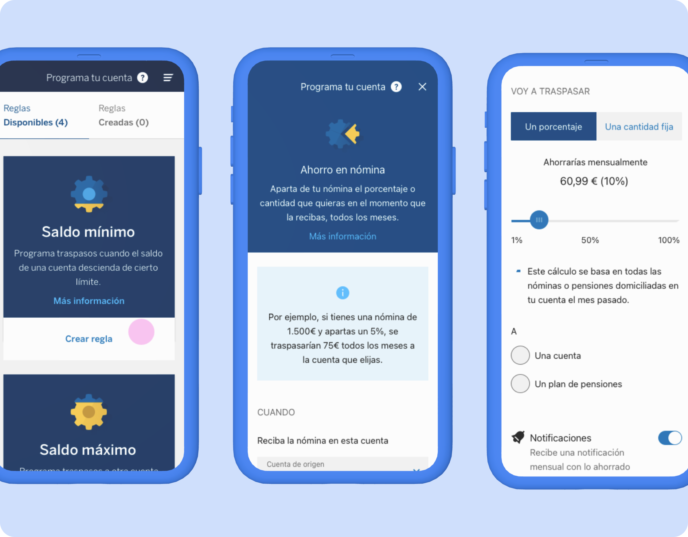

## Objetivos
1. Darle la información necesaria a los clientes para que puedan tomar mejores decisiones.

2. Dar al usuario control sobre su dinero.

3. Automatizar ciertas decisiones para facilitar el ahorro y la gestión de sus actividades financieras diarias.

## Desafío
Crear una herramienta que permita a los usuarios tomar mejores decisiones en sus finanzas. Para ello, creamos un ecosistema de soluciones centradas en:

- Informar. Creamos herramientas para que los usuarios puedan gestionar más fácilmente sus finanzas cotidianas y tomar mejores decisiones.
- Interpretar. Anticipamos proactivamente a los clientes cualquier problema que necesiten conocer (su situación financiera diaria, la necesidad de planificar sus objetivos, etc.).
- Sugerir. Sugerimos a los clientes recomendaciones y acciones totalmente personalizadas que puedan ejecutar fácilmente y de las que podrán hacer un seguimiento sin esfuerzo.
- Automatizar. Ofrecemos a los clientes la oportunidad de automatizar completamente sus decisiones para que no tengan que «preocuparse de sus finanzas».

En este proyecto, nos centramos en los tres últimos puntos mencionados anteriormente creando un servicio que ayuda a los clientes a gestionar su día a día y su ahorro sin esfuerzo, presentando *insights* relevantes basados en sus datos y comportamientos, proponiéndoles soluciones personalizadas y automatizándolas mediante reglas.

## Desarrollo del proyecto

Una vez definidas las reglas de las que iba a disponer el cliente y las notificaciones relevantes, el reto era diseñar y crear una interfaz con una curva de aprendizaje lo más suave posible, ya que era una funcionalidad novedosa no solo para clientes de BBVA, sino para cualquier cliente bancario. 

Para ello, trabajamos en *sprints* de dos semanas en los que se definían en diseño las pantallas de gestión de reglas y notificaciones relevantes en el *user journey* de las reglas (antes y después de configurarlas). En el siguiente *sprint,* mientras el equipo de desarrollo trabajaba en la construcción de la regla diseñada en el *sprint* anterior, en el equipo de diseño definíamos una nueva regla sin dejar de prestar apoyo en la creación.

Para poder alcanzar esta velocidad en la definición, se trabajó con los componentes de la librería de diseño de BBVA.

## Aprendizajes del proyecto

- Diseñar con y para los datos a fin de ofrecer valor al cliente y de hacer que los datos trabajen para ellos, y, a su vez, de simplificar dicha relación para que el usuario tome decisiones informadas y nunca pierda la sensación de control sobre su dinero.
- En este proyecto también tuvimos que prestar especial atención a la narrativa para que se entendiesen cada una de las reglas de automatización y cómo podían sacar mejor provecho de ellas.