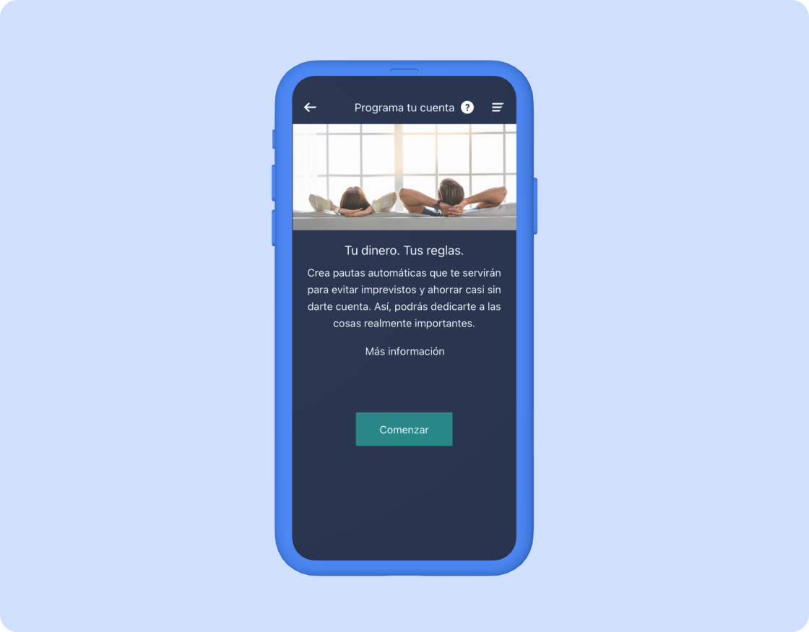

## Objetivos
1. Darle la información necesaria a los clientes para que puedan tomar mejores decisiones.

2. Dar al usuario control sobre su dinero.

3. Automatizar ciertas decisiones para facilitar el ahorro y la gestión de sus actividades financieras diarias.

## Desafio
Crear una herramienta que permita a los usuarios tomar mejores decisiones en sus finanzas. Para ello, creamos un ecosistema de soluciones centradas en:

- Informar. Creamos herramientas para que los usuarios puedan gestionar más fácilmente sus finanzas cotidianas y tomar mejores decisiones.
- Interpretar. Anticipamos proactivamente a los clientes cualquier problema que necesiten conocer (su situación financiera diaria, la necesidad de planificar sus objetivos, etc.).
- Sugerir. Sugerimos a los clientes recomendaciones y acciones totalmente personalizadas que puedan ejecutar fácilmente y de las que podrán hacer un seguimiento sin esfuerzo.
- Automatizar. Ofrecemos a los clientes la oportunidad de automatizar completamente sus decisiones para que no tengan que «preocuparse de sus finanzas».

En este proyecto, nos centramos en los tres últimos puntos mencionados anteriormente creando un servicio que ayuda a los clientes a gestionar su día a día y su ahorro sin esfuerzo, presentando *insights* relevantes basados en sus datos y comportamientos, proponiéndoles soluciones personalizadas y automatizándolas mediante reglas.